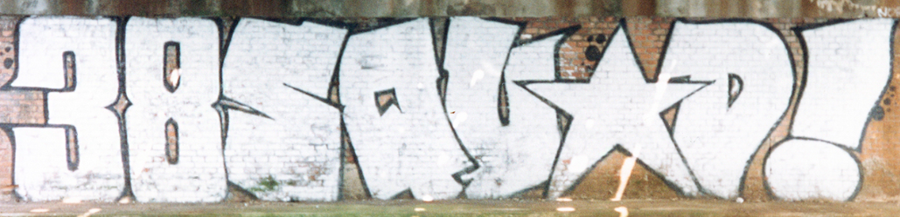
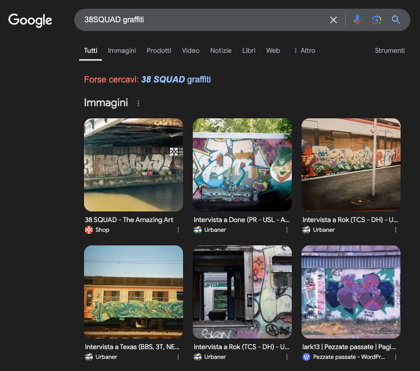
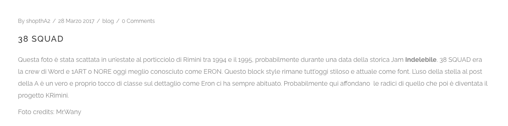
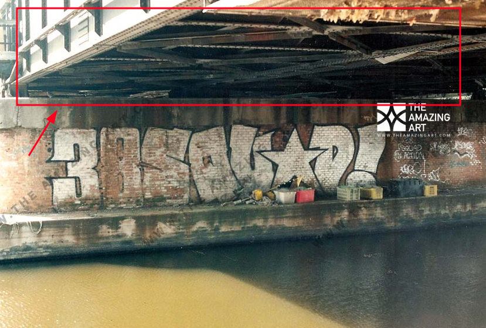
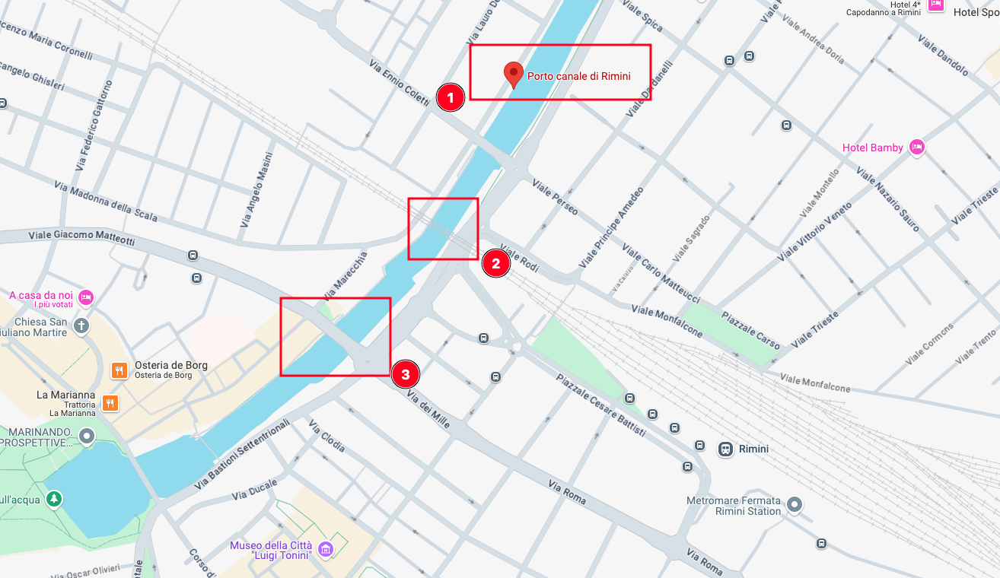
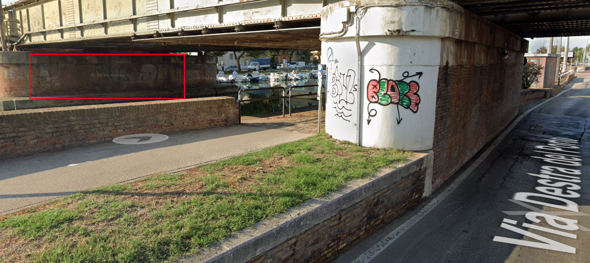
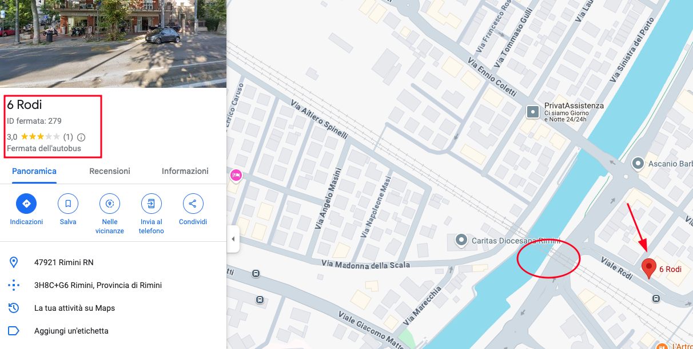

# 01 - EASY CHALLENGE
The flag involves in identifying the Bus stop near the place where this photo was captured.




## CHALLENGE 

### HINT
```
"Hi Frank, how’s it going? I just found a photo on my old camera—I think I took it when we met at the bus stop near the graffiti. Do you remember the name of that stop?"  
```
### FLAG
```
WPCTF{6RODI}
```

## SOLUTION
The position of this graffiti is in Porto Canale of Rimini. 
Looking for the key `38SQUAD graffiti` lets you identify an article related to an old Writing crew called 38SQUAD active in late 90' in Rimini Area.



In this article, it is explained that the photo was taken in the porticciolo of Rimini.



In the newly identified photo, there are several details pertaining to a bridge.



Analyzing the map of porto canale Rimini, three bridges can be identified.



Using Google Street View, it is possible to identify various elements, including graffiti located beneath one of the identified sections of the bridge.



