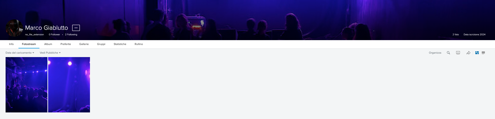
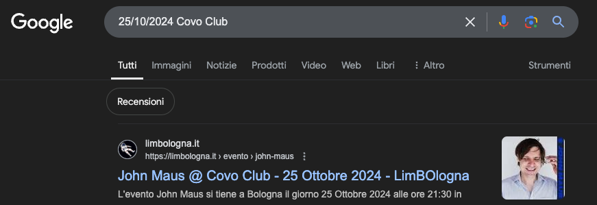
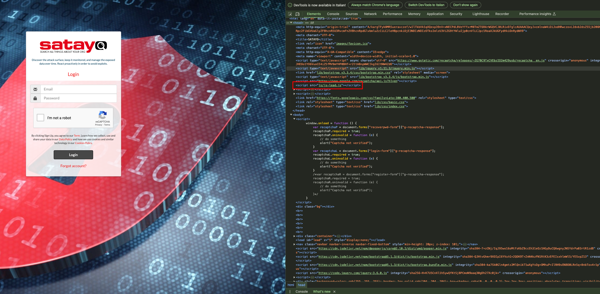
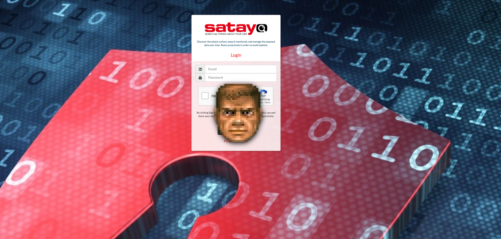

# 02 - HARD CHALLENGE

## CHALLENGE 1 ( UNLOCKED )

### HINT
```
Please provide the name of the service the phishing campaign is targeting in such format `WPCTF{service_url}`
```

### SOLUTION
```
WPCTF{https://satayo.cloud/}
```
  
To identify the given service the analyst needs to identify the logo or insert an email in order to retrieve the URL of Satayo service. The flag will be SATAYO the `WPCTF{https://satayo.cloud/}` of the service.


## CHALLENGE 2 ( LOCKED - NEED CHALLENGE 1 )

### HINT
```
What is the email of the developer (author) of the phishing kit?
```

### SOLUTION
```
WPCTF{evil.evil.evil.evil.evil.999@gmail.com}
```
For retrieving the email of the developer of the phishing kit, the analyst needs to understand that the phishing kit was misconfigured. It exposes a .git directory. USing tool or scripts for resolving it the challenger needs to download it.


Inspecting the project's git history makes it straightforward to identify the developer's email address.  


Using git command ```git log```


## CHALLENGE 3 ( LOCKED - NEED CHALLENGE 2 )

### HINT
```
What is the email of the threat actor?
```

### SOLUTION
```
WPCTF{belzebuohm@gmail.com}
```

Using git command ```git show a2ecde0e4917788fc258b3b2e6f674cb4f60ac71```


From the retrieved token and chat history, it becomes possible to access the complete conversations of the bot.  


Analysts can utilize Discord API for retrieving the information published by the bot.   
An example of a simple script useful for retrieving the data.

```
import discord
from discord.ext import commands

# Intents to enable specific bot functionalities
intents = discord.Intents.default()
intents.messages = True
intents.guilds = True
intents.message_content = True

bt = "quello presente in screen ..."  

@bot.event
async def on_ready():
    print(f"Bot is online as {bot.user}")
    print("Fetching accessible guilds and channels...")

    for guild in bot.guilds:
        print(f"\nGuild: {guild.name} (ID: {guild.id})")
        for channel in guild.text_channels:
            print(f" - Channel: {channel.name} (ID: {channel.id})")
            try:
                # Fetch recent messages from the channel
                print("  Messages:")
                async for message in channel.history(limit=10):  # Limit to the last 5 messages
                    print(f"   [{message.created_at}] {message.author}: {message.content}")
            except Exception as e:
                print(f"   Error accessing channel {channel.name}: {e}")

# Run the bot
bot.run(bt)
```


## CHALLENGE 4 ( LOCKED - NEED CHALLENGE 3 )

### HINT
```
What event did the developer attend(ed)? In detail, what/who was the main attraction?
```

### SOLUTION
```
WPCTF{John Maus}
```

The email `WPCTF{evil.evil.evil.evil.evil.999@gmail.com}` was utilized to register a Flickr account. The process of identification is straightforward. By employing tools like Holehe, participants can uncover social media accounts associated with the identified email.
[GitHub - megadose/holehe](https://github.com/megadose/holehe): holehe allows you to check if the mail is used on different sites like twitter, instagram and will retrieve information on sites with the forgotten password function.

A manual method for identifying user accounts involves retrieving information from the Flickr API.
[Email to Flickr account - OSINT](https://www.aware-online.com/en/email-to-flickr-account-part1/) tutorials by Aware Online

A faster approach will using a payed service like [OSINT Industries | Powerful Tools](https://www.osint.industries/) for Accurate Investigations.


The Flickr profile exposes 2 photos. Both of them aren’t useful for image reverse search.



The date of capture is, however, disclosed. The photo were taken in date 25-10-2024.


Going further and analyzing the given photo, let the participants identify the venue of the concert that is Covo Club in Bologna.


From a reverse image search, the analyst can identify the location as `Covo Club`.    


Looking forward searching for the event and date of the shoot let the analyst to identify the name of `John Maus` the last osint flag of the the comptetion.



## CHALLENGE 5 ( LOCKED - NEED CHALLENGE 4 )

### HINT
```
What is the favorite game of the phishing kit developer?
```

### SOLUTION
```
WPCTF{DOOM}
```

In the source code of the frontend page of the kit there is a strange JavaScript lib, pretty obfuscated.




Using tools like [JavaScript Deobfuscator](https://deobfuscate.relative.im/) the analyst will be able to retrieve the original algorithm. 


The library features an exciting easter egg: when users input the keystrokes IDDQD, a well-known cheat code from DOOM, the face of the main character appears on the frontend. This face changes throughout the day, specifically between 9 AM and 6 PM. As the end of the challenge draws near, the character's expression will become increasingly pained, reflecting the intensity of the situation.  



Searching for the iconic face of the main character from DOOM, the analyst can identify the game as the developer's favorite.

