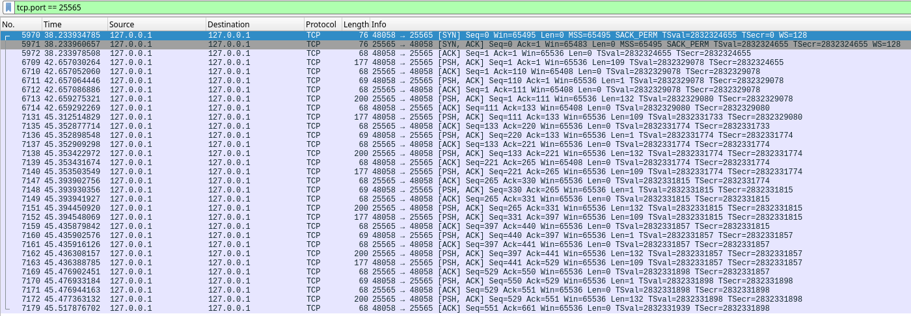

# Writeup: Strange Boltmat

## Challenge overview

User is provided with a binary file `boltmat`. Executing it reveals a CLI
interface and a little game of a vending machine. Doing some experimentation
with the front-end doesn't reveal anything interesting. Time to open our
favorite disassembler and see what's inside.

## Step 1: Disassembling

Opening the binary and finding the `main` function, we see what the program
does at the start.

We can observe that a pipe is created and the program forks. The parent process
looks like to be the CLI interface, since we can recognize some of the strings
that are printed to the console. The child process instead looks like to be more
articulated and does some more interesting stuff.

## Step 2: Analyzing the child process

By reversing the function called by the child process, it's almost immediately
clear that it's sitting in a infinite loop. Right before the loop, there is a
function call that might be interesting to look at. Let's dive in!

Look at that! That is a plain old `socket` call. Is the program trying to connect
to a remote server? Time to fire up Wireshark and see what's going on.

## Step 3: Capturing traffic and failing to find anything

After running the binary and capturing the traffic, nothing seems to be going
on. Let's go back to the disassembler and see if we can find something else.
Inside the infinite loop a `read` happens getting data from the first argument
of the child process's function. This argument must be a file descriptor, and
since nothing much is happening in the main function, it's probably the pipe
that was created at the beginning. We can therefore assume that the parent
process is writing something to the pipe, and the child process is consuming it.
But what is the parent process writing? Diving into the parent process's
function and following some function calls we eventually find a `write` call to
that particular pipe.

Looking at the rest of the disassembled code, we can see that right before
writing. a `read` from the `stdin` happens, and thus the result is written to
the pipe. Let's try to analyze once again the traffic, this time actually
writing something to the CLI interface.

## Step 4: Actually capturing traffic

This time we got lucky! After writing something to the CLI interface, we see
the following traffic in Wireshark.

Following the TCP stream, we can see that some strange XML is being sent with
the key pressed by the user to the server. The server responds with a message
with status `FillingBuffer`. Weird. Let's try to send some more data to the
server and see what happens. Bingo! The server responds with a message with
status `TransactionId` and a character. This is probably the key to the
challenge. Let's try to send once again more data to the server. This time we
can observe that the server returns to the `FillingBuffer` status and sometimes
it returns to the `TransactionId`. Moreover, we can see that the number
of key presses needed to get the `TransactionId` status always changes. Getting
more characters from the server and concatenating them, we get a string that
looks like a flag, but scrambled. We can assume that the position of the
characters in the string is determined by the key presses sent to the server.
Writing a simple script to comply to the protocol which sends the key presses
and gets the server response is pretty trivial, and thus we can get the flag by
reordering the characters in the string by the number of key presses.
