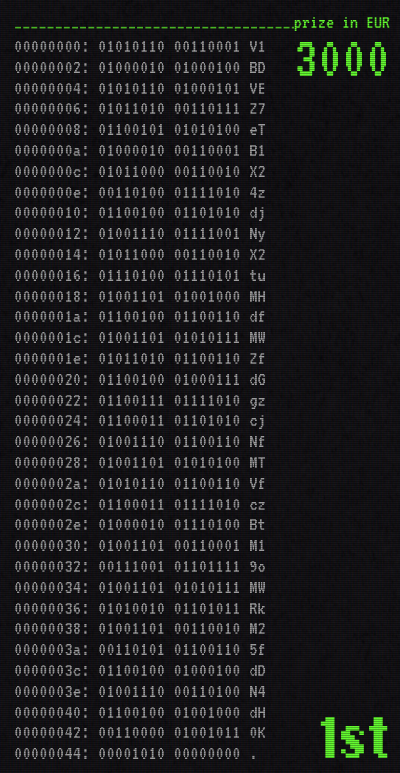

# Writeup: Encrypted echo

The flag is encoded as a base64 string in the first prize in the prizes section.

To get the flag you need to create a string with all the base64 characters and then decode it.

The [exploit.py](exploit.py) script shows how to do it.